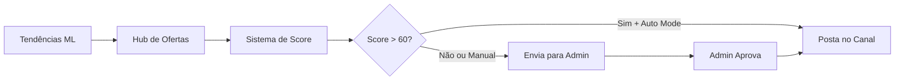

# 🤖 Bot de Promoções Inteligente

Bot automatizado para **Mercado Livre Afiliados** com inteligência de mercado. Monitora tendências em tempo real, classifica ofertas por potencial de conversão e opera de forma autônoma ou manual.

## ✨ Funcionalidades

### 🎯 Core
- **Hub de Afiliados ML**: Acessa sua conta via cookies e minera ofertas com comissão > 10%
- **Geração Automática de Links**: Clica em "Compartilhar" e extrai links `/sec/` automaticamente
- **Envio para Telegram**: Posta ofertas aprovadas no seu canal público

### 🧠 Inteligência de Mercado (NOVO)
- **Monitor de Tendências**: Rastreia as 50 buscas mais quentes do Mercado Livre diariamente
- **Sistema de Scoring**: Classifica ofertas (0-100) baseado em:
  - 40% Comissão de afiliado
  - 35% Relevância com tendências
  - 25% Desconto real sobre preço original
- **Cache Inteligente**: Atualiza tendências a cada 6h (otimizado para baixo consumo)

### 🤖 Modo Autônomo (NOVO)
- **Modo Manual**: Você aprova cada oferta antes de postar (padrão)
- **Modo Autônomo**: Bot posta automaticamente ofertas com score > 60
- **Toggle Simples**: Alterne entre modos com `/auto`

### ✍️ Copywriting Inteligente (NOVO)
- **Headlines com IA**: Gemini gera títulos profissionais e atrativos
- **Formatação BRL**: Preços no padrão brasileiro (R$ 1.250,00)
- **Cálculo de Desconto**: Exibe percentual de economia automaticamente
- **Layout Minimalista**: Mensagens limpas e diretas ao ponto

## 🚀 Quick Start

### 1. Instalação

```bash
git clone [seu-repo]
cd deals-bot
python -m venv venv
venv\Scripts\activate  # Windows
pip install -r requirements.txt
playwright install chromium
```

### 2. Configuração

**Arquivo `.env`** (renomeie `.env.example`):
```env
TELEGRAM_BOT_TOKEN=seu_token_aqui
TELEGRAM_CHAT_ID=@seu_canal
ADMIN_USER_ID=seu_id_telegram
GEMINI_API_KEY=sua_chave_gemini  # Para copywriting com IA
```

**Cookies do Mercado Livre** (`data/cookies.json`):
1. Logue no [Hub de Afiliados](https://www.mercadolivre.com.br/afiliados/hub)
2. Use a extensão [EditThisCookie](https://chrome.google.com/webstore/detail/editthiscookie/)
3. Exporte cookies como JSON
4. Salve em `data/cookies.json`

### 3. Executar

```bash
python main.py
```

## 📖 Comandos

| Comando | Descrição |
|---------|-----------|
| `/status` | Mostra status do bot e modo ativo |
| `/auto` | Liga/desliga modo autônomo |
| `/scan` | Força busca imediata |
| `/hot [termo]` | Adiciona palavra-chave à busca |
| `/block [termo]` | Bloqueia termo no título |

📚 **Documentação completa:** [docs/COMMANDS.md](docs/COMMANDS.md)

## 🎯 Como Funciona



## 📊 Estrutura do Projeto

```
deals-bot/
├── main.py                 # Loop principal
├── scrapers/
│   ├── mercadolivre_hub.py    # Scraper do Hub
│   └── mercadolivre_trends.py # Monitor de tendências
├── core/
│   ├── scoring.py             # Sistema de pontuação
│   ├── autonomous_mode.py     # Gerenciador de modo
│   └── database.py            # Controle de duplicatas
├── services/
│   ├── notifier.py            # Telegram bot
│   └── copywriter.py          # Geração de copy com IA
├── data/
│   ├── cookies.json           # Sessão ML (você cria)
│   ├── trends_cache.json      # Cache de tendências
│   └── bot_config.json        # Configuração de modo
└── docs/
    ├── COMMANDS.md            # Referência de comandos
    └── trends_integration_plan.md  # Documentação técnica
```

## 🔧 Configurações Avançadas

**`main.py` - Frequências:**
```python
ML_FREQUENCY = 1        # Ciclos entre buscas no Hub
REPORT_FREQUENCY = 10   # Ciclos entre relatórios
```

**`core/scoring.py` - Pesos do Score:**
```python
COMMISSION_WEIGHT = 40  # Peso da comissão
TREND_WEIGHT = 35       # Peso da tendência
DISCOUNT_WEIGHT = 25    # Peso do desconto
```

## 🛡️ Segurança

- ✅ `playwright-stealth`: Anti-detecção de bot
- ✅ Cookies de sessão real (não usa credenciais)
- ✅ Rate limiting inteligente
- ✅ Intervalos aleatórios entre requisições

## 📝 Logs

Logs salvos em `logs/bot.log` com rotação automática.

## 🤝 Contribuindo

Contribuições são bem-vindas! Veja [CONTRIBUTING.md](CONTRIBUTING.md) para guidelines.

## 📄 Licença

MIT License - veja [LICENSE](LICENSE) para detalhes.

---

**Dúvidas?** Abra uma [issue](../../issues) ou consulte a [documentação completa](docs/).
