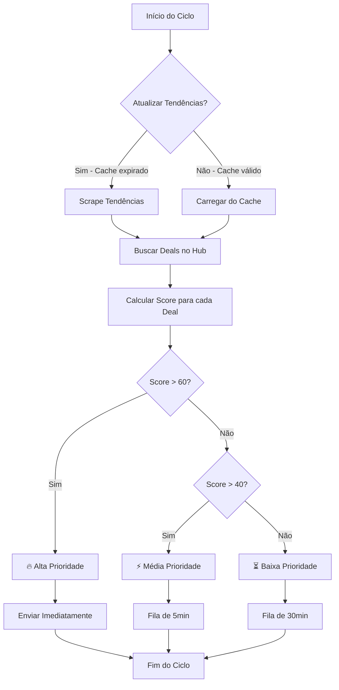

# Estratégia de Integração: Tendências do Mercado Livre

## Contexto

O bot atualmente busca ofertas apenas no **Hub de Afiliados do Mercado Livre**, filtrando por comissões extras acima de 10%. A proposta é adicionar uma camada de inteligência usando as **tendências do Mercado Livre** para priorizar produtos com alta demanda de mercado.

## Análise da Página de Tendências

### Estrutura Identificada

A página `https://tendencias.mercadolivre.com.br/` possui:

1. **Carrosséis de Tendências** (3 principais):
   - 🚀 **As buscas que mais cresceram** - Produtos com crescimento explosivo
   - ❤️ **As buscas mais desejadas** - Produtos em wishlists
   - 🔥 **As tendências mais populares** - Top geral

2. **Categorias Específicas** (15+ categorias):
   - Beleza e Cuidado Pessoal
   - Eletrônicos
   - Moda
   - Casa e Jardim
   - etc.

3. **Volume de Dados**:
   - ~10-20 termos por carrossel
   - ~200-500 keywords de alta conversão disponíveis diariamente

### Seletores HTML Identificados

```javascript
// Página principal
const mainTrends = document.querySelectorAll('a.ui-search-entry-container h3');

// Páginas de categoria
const categoryTrends = document.querySelectorAll('a.seo-ui-trends-entry-link');
```

## User Review Required

> [!IMPORTANT]
> **Decisão de Arquitetura: Estratégia de Busca**
> 
> Propondo uma abordagem **híbrida inteligente** que combina:
> 1. **Hub de Afiliados** (fonte primária - já tem comissão garantida)
> 2. **Tendências** (filtro secundário - valida demanda de mercado)
> 
> Isso evita sobrecarga de requisições e maximiza conversão.

> [!IMPORTANT]
> **Nova Feature: Modo Autônomo**
> 
> Sistema de toggle para alternar entre:
> - **Modo Manual** (padrão atual): Admin aprova cada oferta antes de postar
> - **Modo Autônomo**: Bot posta automaticamente ofertas com score alto (>60)
> 
> **Benefícios**:
> - Flexibilidade total: Admin pode supervisionar quando quiser
> - Escalabilidade: Modo auto permite operação 24/7 sem intervenção
> - Segurança: Score mínimo garante qualidade mesmo no modo auto

> [!WARNING]
> **Impacto de Performance**
> 
> O scraping de tendências adiciona:
> - 1 requisição HTTP a cada 6-12 horas (cache)
> - ~5-10 segundos de processamento
> - Armazenamento de ~50-100 keywords em memória
> 
> **Mitigação**: Cache local com TTL de 6h + scraping assíncrono em background.

## Proposed Changes

### Componente 1: Scraper de Tendências

#### [NEW] [mercadolivre_trends.py](file:///c:/Users/Lucas%20Siqueira/Documents/deals-bot/scrapers/mercadolivre_trends.py)

**Responsabilidades**:
- Scraping da página de tendências (main + top 3 categorias)
- Cache local com TTL de 6 horas
- Extração de termos com ranking/prioridade

**Funcionalidades**:
```python
class MercadoLivreTrendsScraper:
    async def fetch_trending_terms() -> List[TrendingTerm]
    async def get_cached_trends() -> List[TrendingTerm]
    async def _scrape_main_page() -> List[str]
    async def _scrape_category(category: str) -> List[str]
```

**Otimizações**:
- ✅ Usa Playwright com headless mode
- ✅ Cache em arquivo JSON (`data/trends_cache.json`)
- ✅ Scraping apenas de categorias relevantes (configurável)
- ✅ Rate limiting: 1 requisição a cada 6h

---

### Componente 2: Sistema de Pontuação

#### [NEW] [core/scoring.py](file:///c:/Users/Lucas%20Siqueira/Documents/deals-bot/core/scoring.py)

**Responsabilidades**:
- Calcular score de relevância para cada deal
- Combinar múltiplos fatores (comissão, tendência, desconto)

**Algoritmo de Scoring**:

```python
def calculate_deal_score(deal: Deal, trending_terms: List[str]) -> float:
    score = 0
    
    # Fator 1: Comissão (peso 40%)
    score += (deal.discount_percentage / 100) * 40
    
    # Fator 2: Tendência (peso 35%)
    if any(term.lower() in deal.title.lower() for term in trending_terms):
        score += 35
    
    # Fator 3: Desconto real (peso 25%)
    if deal.original_price:
        discount = ((deal.original_price - deal.price) / deal.original_price) * 100
        score += (discount / 100) * 25
    
    return score
```

**Priorização**:
- Score > 60: 🔥 **Alta prioridade** (envia imediatamente)
- Score 40-60: ⚡ **Média prioridade** (envia após 5min)
- Score < 40: ⏳ **Baixa prioridade** (envia apenas se canal vazio)

---

### Componente 3: Sistema de Modo Autônomo

#### [NEW] [core/autonomous_mode.py](file:///c:/Users/Lucas%20Siqueira/Documents/deals-bot/core/autonomous_mode.py)

**Responsabilidades**:
- Gerenciar estado do modo (manual/autônomo)
- Persistir configuração em arquivo
- Fornecer interface para toggle

**Funcionalidades**:
```python
class AutonomousMode:
    def __init__(self, config_path="data/bot_config.json"):
        self.config_path = config_path
        self.is_autonomous = self._load_config()
    
    def toggle(self) -> bool:
        """Alterna entre manual/autônomo. Retorna novo estado."""
        self.is_autonomous = not self.is_autonomous
        self._save_config()
        return self.is_autonomous
    
    def set_mode(self, autonomous: bool):
        """Define modo explicitamente."""
        self.is_autonomous = autonomous
        self._save_config()
    
    def get_status(self) -> dict:
        """Retorna status atual."""
        return {
            "mode": "Autônomo" if self.is_autonomous else "Manual",
            "description": self._get_mode_description()
        }
```

**Arquivo de Configuração** (`data/bot_config.json`):
```json
{
  "autonomous_mode": false,
  "auto_post_min_score": 60,
  "last_updated": "2026-01-24T18:50:00"
}
```

**Comportamento por Modo**:

| Modo | Score > 60 | Score 40-60 | Score < 40 |
|------|------------|-------------|------------|
| **Manual** | Admin aprova | Admin aprova | Admin aprova |
| **Autônomo** | 🤖 Posta direto no canal | Admin aprova | Descarta |

---

### Componente 4: Comandos do Telegram

#### [MODIFY] [main.py](file:///c:/Users/Lucas%20Siqueira/Documents/deals-bot/main.py) - Handlers

**Novo comando `/auto`**:

```python
async def handle_auto_toggle(update: Update, context: ContextTypes.DEFAULT_TYPE):
    """Toggle entre modo manual e autônomo."""
    if not is_admin(update): 
        return
    
    from core.autonomous_mode import AutonomousMode
    auto_mode = AutonomousMode()
    
    new_state = auto_mode.toggle()
    
    if new_state:
        emoji = "🤖"
        mode = "AUTÔNOMO"
        description = (
            "O bot agora postará automaticamente ofertas com score alto (>60) "
            "diretamente no canal. Ofertas com score médio (40-60) ainda "
            "precisarão de sua aprovação."
        )
    else:
        emoji = "👤"
        mode = "MANUAL"
        description = (
            "O bot agora enviará todas as ofertas para você aprovar "
            "antes de postar no canal."
        )
    
    text = (
        f"{emoji} <b>Modo {mode} Ativado</b>\n\n"
        f"{description}\n\n"
        f"💡 <i>Use /auto novamente para alternar.</i>"
    )
    
    await update.message.reply_text(text, parse_mode=ParseMode.HTML)
```

**Atualizar comando `/status`**:

```python
async def handle_status(update: Update, context: ContextTypes.DEFAULT_TYPE):
    if not is_admin(update): return
    
    from core.autonomous_mode import AutonomousMode
    auto_mode = AutonomousMode()
    status = auto_mode.get_status()
    
    db = Database()
    report = (
        "🤖 <b>Bot Online & Operante</b>\n\n"
        f"📊 <b>Modo:</b> {status['mode']}\n"
        f"📉 <b>Banco de Dados:</b> {db.get_total_count()} itens\n"
        "✨ <i>Envie um link direto para postar agora!</i>"
    )
    await update.message.reply_text(report, parse_mode=ParseMode.HTML)
```

**Registrar handler** (linha ~196):
```python
telegram_handlers = {
    # ... handlers existentes ...
    'auto': handle_auto_toggle,  # NOVO
}
```

---

### Componente 5: Integração no Loop Principal

#### [MODIFY] [main.py](file:///c:/Users/Lucas%20Siqueira/Documents/deals-bot/main.py)

**Mudanças**:

1. **Inicialização do Trends Scraper** (linha ~190):
```python
ml_hub_scraper = MercadoLivreHubScraper()
trends_scraper = MercadoLivreTrendsScraper()  # NOVO
```

2. **Busca de Tendências** (linha ~230, antes do loop de deals):
```python
# Atualiza tendências a cada 6h
trending_terms = await trends_scraper.get_cached_trends()
logger.info(f"📊 Tendências ativas: {len(trending_terms)} termos")
```

3. **Scoring e Priorização com Modo Autônomo** (linha ~290, após buscar deals):
```python
from core.scoring import calculate_deal_score
from core.autonomous_mode import AutonomousMode

auto_mode = AutonomousMode()

# Adiciona score a cada deal
for deal in unique_deals:
    deal.score = calculate_deal_score(deal, trending_terms)

# Ordena por score (maior primeiro)
sorted_deals = sorted(unique_deals, key=lambda d: d.score, reverse=True)

# Envia apenas top 10 por ciclo (evita spam)
for deal in sorted_deals[:10]:
    if not db.is_deal_sent(deal.url, deal.price):
        
        # LÓGICA DO MODO AUTÔNOMO
        if auto_mode.is_autonomous and deal.score >= 60:
            # Modo autônomo + score alto = Posta direto no canal
            logger.info(f"🤖 AUTO-POST: {deal.title[:30]}... (Score: {deal.score:.1f})")
            await notifier.send_deal(deal, to_admin=False)  # Direto pro canal!
        
        elif deal.score >= 40:
            # Score médio ou modo manual = Envia para admin aprovar
            logger.info(f"👤 APPROVAL: {deal.title[:30]}... (Score: {deal.score:.1f})")
            await notifier.send_deal(deal, to_admin=True)
        
        else:
            # Score baixo = Descarta
            logger.info(f"⏭️ SKIP: {deal.title[:30]}... (Score: {deal.score:.1f})")
            continue
        
        db.add_sent_deal(deal)
        await asyncio.sleep(5)
```

---

### Componente 4: Modelo de Dados

#### [MODIFY] [models/deal.py](file:///c:/Users/Lucas%20Siqueira/Documents/deals-bot/models/deal.py)

**Adicionar campo de score**:
```python
@dataclass
class Deal:
    # ... campos existentes ...
    score: float = 0.0  # NOVO
```

#### [NEW] [models/trending_term.py](file:///c:/Users/Lucas%20Siqueira/Documents/deals-bot/models/trending_term.py)

**Novo modelo para tendências**:
```python
@dataclass
class TrendingTerm:
    term: str
    category: str
    trend_type: str  # "crescimento", "desejado", "popular"
    rank: int
    url: str
```

---

### Componente 5: Cache de Tendências

#### [NEW] [data/trends_cache.json](file:///c:/Users/Lucas%20Siqueira/Documents/deals-bot/data/trends_cache.json)

**Estrutura**:
```json
{
  "last_updated": "2026-01-24T18:00:00",
  "ttl_hours": 6,
  "trends": [
    {
      "term": "smartwatch",
      "category": "Eletrônicos",
      "trend_type": "crescimento",
      "rank": 1,
      "url": "https://lista.mercadolivre.com.br/smartwatch#trend"
    }
  ]
}
```

---

## Estratégia de Busca Otimizada

### Fluxo de Decisão



### Configurações Recomendadas

```python
# config/settings.py (NOVO)
TRENDS_CONFIG = {
    "cache_ttl_hours": 6,
    "max_trends_per_category": 10,
    "priority_categories": [
        "Eletrônicos",
        "Beleza e Cuidado Pessoal",
        "Moda"
    ],
    "min_score_to_send": 40,
    "max_deals_per_cycle": 10
}
```

---

## Otimizações de Recursos

### 1. Rate Limiting Inteligente

```python
# Evita sobrecarga
- Hub scraping: 1x a cada 30min (já implementado)
- Trends scraping: 1x a cada 6h (NOVO)
- Deal processing: Max 10 deals/ciclo (NOVO)
```

### 2. Rotação de Categorias

```python
# Alterna categorias a cada ciclo para cobrir mais terreno
categories = ["Eletrônicos", "Beleza", "Moda", "Casa"]
current_category = categories[cycle_count % len(categories)]
```

### 3. Filtragem Preventiva

```python
# Evita processar deals irrelevantes
- Blacklist já implementada ✅
- Score mínimo de 40 (NOVO)
- Limite de 10 deals/ciclo (NOVO)
```

---

## Verification Plan

### Automated Tests

```bash
# Teste do scraper de tendências
python -m pytest tests/test_trends_scraper.py -v

# Teste do sistema de scoring
python -m pytest tests/test_scoring.py -v

# Teste de integração
python -m pytest tests/test_integration.py -v
```

### Manual Verification

1. **Teste de Scraping**:
   ```bash
   python scrapers/mercadolivre_trends.py
   # Deve retornar ~50-100 termos em <10s
   ```

2. **Teste de Scoring**:
   ```bash
   python scripts/test_scoring.py
   # Deve mostrar deals ordenados por score
   ```

3. **Teste em Produção** (Fase 1 - Limitada):
   - Ativar com `max_deals_per_cycle=3`
   - Monitorar por 24h
   - Verificar taxa de conversão vs. baseline

4. **Métricas a Acompanhar**:
   - Taxa de cliques (CTR)
   - Taxa de conversão
   - Tempo de processamento por ciclo
   - Uso de memória

---

## Sugestões Adicionais

### Melhoria 1: Atualizar Comando /help

Adicionar documentação do novo comando:

```python
async def handle_help(update: Update, context: ContextTypes.DEFAULT_TYPE):
    if not is_admin(update): return
    help_text = (
        "📖 <b>Guia de Comandos do Bot</b>\n\n"
        "🔗 <b>Links Diretos:</b> Basta colar um link no chat para postar.\n"
        "📊 <b>/status:</b> Resumo de atividade do bot.\n\n"
        "🤖 <b>Modo de Operação:</b>\n"
        "• <b>/auto:</b> Alterna entre modo Manual e Autônomo.\n\n"
        "🔥 <b>Busca Ativa (Keywords):</b>\n"
        "• <b>/hot [termo]:</b> Adiciona produto à busca.\n"
        "• <b>/hot_list:</b> Lista termos ativos.\n"
        "• <b>/remove_hot [termo]:</b> Remove termo.\n\n"
        "🚫 <b>Segurança (Blacklist):</b>\n"
        "• <b>/block [termo]:</b> Bloqueia palavras no título.\n"
        "• <b>/block_list:</b> Lista termos bloqueados.\n"
        "• <b>/remove_block [termo]:</b> Desbloqueia termo.\n\n"
        "💡 <i>Dica: Links manuais são limpos automaticamente após o envio!</i>"
    )
    await update.message.reply_text(help_text, parse_mode=ParseMode.HTML)
```

---

### Melhoria 2: Dashboard de Tendências

Adicionar comando `/trends` para visualizar tendências ativas:

```python
async def handle_trends(update: Update, context: ContextTypes.DEFAULT_TYPE):
    trends = await trends_scraper.get_cached_trends()
    top_10 = trends[:10]
    
    text = "📊 **Top 10 Tendências Ativas**\n\n"
    for i, trend in enumerate(top_10, 1):
        text += f"{i}. 🔥 {trend.term} ({trend.trend_type})\n"
    
    await update.message.reply_text(text, parse_mode=ParseMode.MARKDOWN)
```

### Melhoria 2: A/B Testing

Implementar flag para comparar performance:

```python
# .env
ENABLE_TRENDS=true
TRENDS_WEIGHT=0.35  # Peso do fator tendência no score
```

### Melhoria 3: Machine Learning (Futuro)

Coletar dados de conversão para treinar modelo preditivo:

```python
# Salvar histórico de deals enviados + conversões
# Treinar modelo para prever probabilidade de conversão
# Ajustar pesos do scoring automaticamente
```

---

## Próximos Passos

1. ✅ **Revisar este plano** - Confirmar estratégia
2. ⏳ **Implementar scraper** - Criar `mercadolivre_trends.py`
3. ⏳ **Implementar scoring** - Criar `core/scoring.py`
4. ⏳ **Integrar no main.py** - Adicionar lógica de priorização
5. ⏳ **Testar** - Validar funcionamento
6. ⏳ **Deploy gradual** - Começar com limite de 3 deals/ciclo
